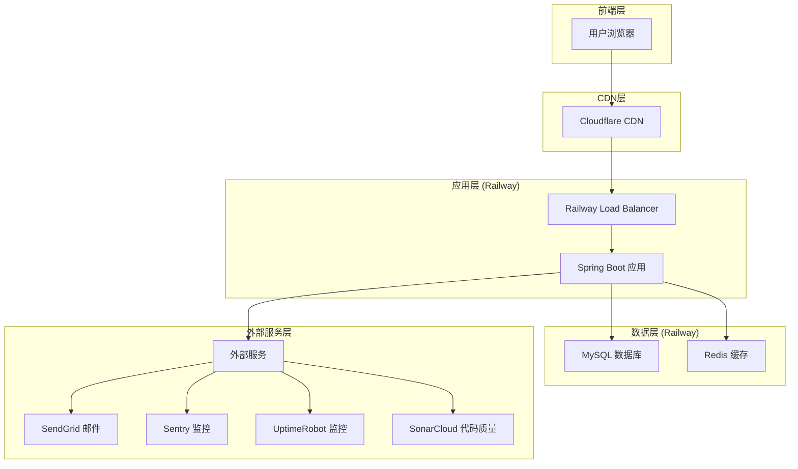
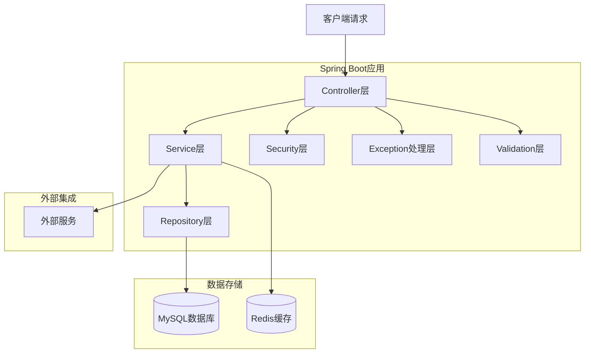
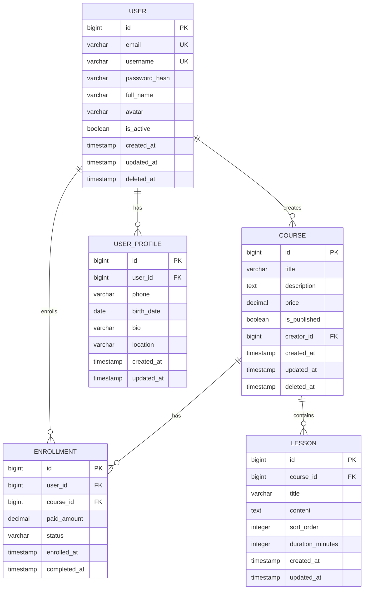
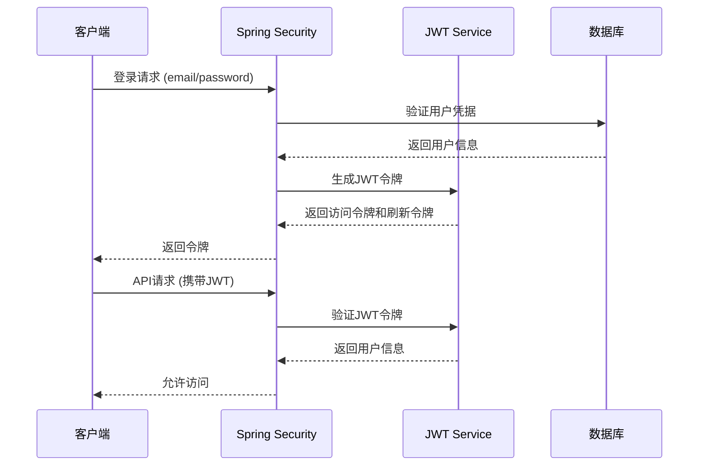

# 万里后端项目技术架构文档

## 1. 架构设计



## 2. 技术描述

- **前端**: React 18 + TypeScript + Vite + TailwindCSS
- **后端**: Spring Boot 3.2.x + Java 17 + Maven 3.9.x
- **数据库**: MySQL 8.0 (Railway托管)
- **缓存**: Redis 7.x (Railway托管)
- **部署**: Railway平台 + Docker容器
- **CI/CD**: GitHub Actions
- **监控**: Sentry + UptimeRobot + Spring Boot Actuator
- **代码质量**: SonarCloud + Checkstyle + SpotBugs

## 3. 路由定义

| 路由 | 用途 |
|------|------|
| /api/auth/login | 用户登录接口 |
| /api/auth/register | 用户注册接口 |
| /api/auth/refresh | JWT令牌刷新 |
| /api/users/profile | 用户个人资料管理 |
| /api/courses | 课程管理接口 |
| /api/courses/{id} | 单个课程操作 |
| /api/health | 应用健康检查 |
| /api/actuator/health | Spring Boot健康检查 |
| /api/actuator/info | 应用信息接口 |
| /api/actuator/metrics | 应用指标监控 |

## 4. API定义

### 4.1 核心API

#### 用户认证相关

**用户登录**
```
POST /api/auth/login
```

请求参数:
| 参数名 | 参数类型 | 是否必需 | 描述 |
|--------|----------|----------|------|
| email | string | true | 用户邮箱 |
| password | string | true | 用户密码 |

响应参数:
| 参数名 | 参数类型 | 描述 |
|--------|----------|------|
| success | boolean | 请求是否成功 |
| message | string | 响应消息 |
| data | object | 响应数据 |
| data.token | string | JWT访问令牌 |
| data.refreshToken | string | JWT刷新令牌 |
| data.user | object | 用户信息 |

请求示例:
```json
{
  "email": "user@example.com",
  "password": "password123"
}
```

响应示例:
```json
{
  "success": true,
  "message": "登录成功",
  "data": {
    "token": "eyJhbGciOiJIUzI1NiIsInR5cCI6IkpXVCJ9...",
    "refreshToken": "eyJhbGciOiJIUzI1NiIsInR5cCI6IkpXVCJ9...",
    "user": {
      "id": 1,
      "email": "user@example.com",
      "username": "user123",
      "fullName": "张三"
    }
  }
}
```

**用户注册**
```
POST /api/auth/register
```

请求参数:
| 参数名 | 参数类型 | 是否必需 | 描述 |
|--------|----------|----------|------|
| email | string | true | 用户邮箱 |
| username | string | true | 用户名 |
| password | string | true | 用户密码 |
| fullName | string | false | 用户全名 |

响应参数:
| 参数名 | 参数类型 | 描述 |
|--------|----------|------|
| success | boolean | 请求是否成功 |
| message | string | 响应消息 |
| data | object | 用户信息 |

#### 课程管理相关

**获取课程列表**
```
GET /api/courses
```

查询参数:
| 参数名 | 参数类型 | 是否必需 | 描述 |
|--------|----------|----------|------|
| page | integer | false | 页码，默认0 |
| size | integer | false | 每页大小，默认10 |
| sort | string | false | 排序字段，默认createdAt |
| direction | string | false | 排序方向，默认desc |

响应参数:
| 参数名 | 参数类型 | 描述 |
|--------|----------|------|
| success | boolean | 请求是否成功 |
| message | string | 响应消息 |
| data | object | 分页数据 |
| data.content | array | 课程列表 |
| data.totalElements | integer | 总记录数 |
| data.totalPages | integer | 总页数 |

**创建课程**
```
POST /api/courses
```

请求参数:
| 参数名 | 参数类型 | 是否必需 | 描述 |
|--------|----------|----------|------|
| title | string | true | 课程标题 |
| description | string | false | 课程描述 |
| price | decimal | false | 课程价格 |

### 4.2 健康检查API

**应用健康检查**
```
GET /api/health
```

响应示例:
```json
{
  "status": "UP",
  "service": "wanli-backend",
  "version": "1.0.0",
  "database": "UP",
  "redis": "UP",
  "timestamp": "2024-01-20T10:30:00Z"
}
```

## 5. 服务器架构图



## 6. 数据模型

### 6.1 数据模型定义



### 6.2 数据定义语言

**用户表 (users)**
```sql
-- 创建用户表
CREATE TABLE users (
    id BIGINT AUTO_INCREMENT PRIMARY KEY,
    email VARCHAR(255) NOT NULL UNIQUE,
    username VARCHAR(100) NOT NULL UNIQUE,
    password_hash VARCHAR(255) NOT NULL,
    full_name VARCHAR(200),
    avatar VARCHAR(500),
    is_active BOOLEAN DEFAULT TRUE,
    created_at TIMESTAMP DEFAULT CURRENT_TIMESTAMP,
    updated_at TIMESTAMP DEFAULT CURRENT_TIMESTAMP ON UPDATE CURRENT_TIMESTAMP,
    deleted_at TIMESTAMP NULL,
    
    INDEX idx_users_email (email),
    INDEX idx_users_username (username),
    INDEX idx_users_created_at (created_at)
) ENGINE=InnoDB DEFAULT CHARSET=utf8mb4 COLLATE=utf8mb4_unicode_ci;

-- 初始化管理员用户
INSERT INTO users (email, username, password_hash, full_name, is_active) VALUES
('admin@wanli.com', 'admin', '$2a$10$example_hash', '系统管理员', TRUE);
```

**用户资料表 (user_profiles)**
```sql
-- 创建用户资料表
CREATE TABLE user_profiles (
    id BIGINT AUTO_INCREMENT PRIMARY KEY,
    user_id BIGINT NOT NULL,
    phone VARCHAR(20),
    birth_date DATE,
    bio TEXT,
    location VARCHAR(200),
    created_at TIMESTAMP DEFAULT CURRENT_TIMESTAMP,
    updated_at TIMESTAMP DEFAULT CURRENT_TIMESTAMP ON UPDATE CURRENT_TIMESTAMP,
    
    FOREIGN KEY (user_id) REFERENCES users(id) ON DELETE CASCADE,
    INDEX idx_user_profiles_user_id (user_id)
) ENGINE=InnoDB DEFAULT CHARSET=utf8mb4 COLLATE=utf8mb4_unicode_ci;
```

**课程表 (courses)**
```sql
-- 创建课程表
CREATE TABLE courses (
    id BIGINT AUTO_INCREMENT PRIMARY KEY,
    title VARCHAR(255) NOT NULL,
    description TEXT,
    price DECIMAL(10,2) DEFAULT 0.00,
    is_published BOOLEAN DEFAULT FALSE,
    creator_id BIGINT NOT NULL,
    created_at TIMESTAMP DEFAULT CURRENT_TIMESTAMP,
    updated_at TIMESTAMP DEFAULT CURRENT_TIMESTAMP ON UPDATE CURRENT_TIMESTAMP,
    deleted_at TIMESTAMP NULL,
    
    FOREIGN KEY (creator_id) REFERENCES users(id),
    INDEX idx_courses_creator_id (creator_id),
    INDEX idx_courses_created_at (created_at),
    INDEX idx_courses_is_published (is_published)
) ENGINE=InnoDB DEFAULT CHARSET=utf8mb4 COLLATE=utf8mb4_unicode_ci;

-- 初始化示例课程
INSERT INTO courses (title, description, price, is_published, creator_id) VALUES
('Java基础教程', 'Java编程语言基础知识学习', 99.00, TRUE, 1),
('Spring Boot实战', 'Spring Boot框架实战开发', 199.00, TRUE, 1);
```

**课程章节表 (lessons)**
```sql
-- 创建课程章节表
CREATE TABLE lessons (
    id BIGINT AUTO_INCREMENT PRIMARY KEY,
    course_id BIGINT NOT NULL,
    title VARCHAR(255) NOT NULL,
    content TEXT,
    sort_order INTEGER DEFAULT 0,
    duration_minutes INTEGER DEFAULT 0,
    created_at TIMESTAMP DEFAULT CURRENT_TIMESTAMP,
    updated_at TIMESTAMP DEFAULT CURRENT_TIMESTAMP ON UPDATE CURRENT_TIMESTAMP,
    
    FOREIGN KEY (course_id) REFERENCES courses(id) ON DELETE CASCADE,
    INDEX idx_lessons_course_id (course_id),
    INDEX idx_lessons_sort_order (sort_order)
) ENGINE=InnoDB DEFAULT CHARSET=utf8mb4 COLLATE=utf8mb4_unicode_ci;
```

**课程注册表 (enrollments)**
```sql
-- 创建课程注册表
CREATE TABLE enrollments (
    id BIGINT AUTO_INCREMENT PRIMARY KEY,
    user_id BIGINT NOT NULL,
    course_id BIGINT NOT NULL,
    paid_amount DECIMAL(10,2) DEFAULT 0.00,
    status VARCHAR(20) DEFAULT 'ACTIVE',
    enrolled_at TIMESTAMP DEFAULT CURRENT_TIMESTAMP,
    completed_at TIMESTAMP NULL,
    
    FOREIGN KEY (user_id) REFERENCES users(id),
    FOREIGN KEY (course_id) REFERENCES courses(id),
    UNIQUE KEY uk_enrollments_user_course (user_id, course_id),
    INDEX idx_enrollments_user_id (user_id),
    INDEX idx_enrollments_course_id (course_id),
    INDEX idx_enrollments_status (status)
) ENGINE=InnoDB DEFAULT CHARSET=utf8mb4 COLLATE=utf8mb4_unicode_ci;
```

**系统配置表 (system_configs)**
```sql
-- 创建系统配置表
CREATE TABLE system_configs (
    id BIGINT AUTO_INCREMENT PRIMARY KEY,
    config_key VARCHAR(100) NOT NULL UNIQUE,
    config_value TEXT,
    description VARCHAR(500),
    created_at TIMESTAMP DEFAULT CURRENT_TIMESTAMP,
    updated_at TIMESTAMP DEFAULT CURRENT_TIMESTAMP ON UPDATE CURRENT_TIMESTAMP,
    
    INDEX idx_system_configs_key (config_key)
) ENGINE=InnoDB DEFAULT CHARSET=utf8mb4 COLLATE=utf8mb4_unicode_ci;

-- 初始化系统配置
INSERT INTO system_configs (config_key, config_value, description) VALUES
('site.name', '万里学习平台', '网站名称'),
('site.description', '专业的在线学习平台', '网站描述'),
('mail.from', 'noreply@wanli.com', '系统邮件发送地址'),
('upload.max_size', '10485760', '文件上传最大大小(字节)');
```

## 7. 安全架构

### 7.1 认证授权流程



### 7.2 数据安全措施

1. **密码加密**: 使用BCrypt算法加密存储
2. **JWT令牌**: 使用HS256算法签名
3. **HTTPS强制**: 生产环境强制使用HTTPS
4. **SQL注入防护**: 使用JPA参数化查询
5. **XSS防护**: 输入验证和输出编码
6. **CSRF防护**: 使用Spring Security CSRF保护

## 8. 性能优化

### 8.1 缓存策略

```java
// Redis缓存配置
@Configuration
@EnableCaching
public class CacheConfig {
    
    @Bean
    public CacheManager cacheManager(RedisConnectionFactory factory) {
        RedisCacheConfiguration config = RedisCacheConfiguration.defaultCacheConfig()
            .entryTtl(Duration.ofMinutes(30))
            .serializeKeysWith(RedisSerializationContext.SerializationPair
                .fromSerializer(new StringRedisSerializer()))
            .serializeValuesWith(RedisSerializationContext.SerializationPair
                .fromSerializer(new GenericJackson2JsonRedisSerializer()));
        
        return RedisCacheManager.builder(factory)
            .cacheDefaults(config)
            .build();
    }
}
```

### 8.2 数据库优化

1. **连接池配置**: HikariCP连接池优化
2. **索引优化**: 为常用查询字段添加索引
3. **分页查询**: 使用Spring Data JPA分页
4. **懒加载**: JPA关联关系懒加载

### 8.3 JVM调优

```bash
# 生产环境JVM参数
JAVA_OPTS="-Xms512m -Xmx1024m -XX:+UseG1GC -XX:+UseContainerSupport -XX:MaxRAMPercentage=75.0 -XX:+HeapDumpOnOutOfMemoryError"
```

## 9. 监控和日志

### 9.1 应用监控

- **健康检查**: Spring Boot Actuator
- **指标收集**: Micrometer + Prometheus
- **错误追踪**: Sentry集成
- **性能监控**: APM工具集成

### 9.2 日志配置

```yaml
# logback-spring.xml配置
logging:
  level:
    com.wanli: INFO
    org.springframework.security: WARN
    org.hibernate.SQL: DEBUG
  pattern:
    console: "%d{yyyy-MM-dd HH:mm:ss} [%thread] %-5level %logger{36} - %msg%n"
    file: "%d{yyyy-MM-dd HH:mm:ss} [%thread] %-5level %logger{36} - %msg%n"
  file:
    name: logs/wanli-backend.log
    max-size: 100MB
    max-history: 30
```

---

**技术架构特点**:
1. 采用微服务友好的Spring Boot架构
2. 使用Railway云平台简化部署和运维
3. 集成完整的CI/CD流程
4. 实现全面的监控和日志记录
5. 遵循安全最佳实践
6. 支持水平扩展和高可用部署