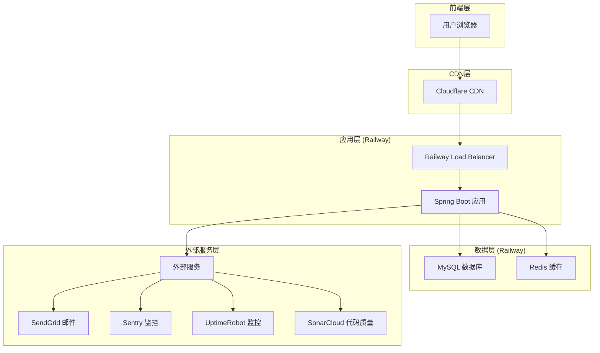
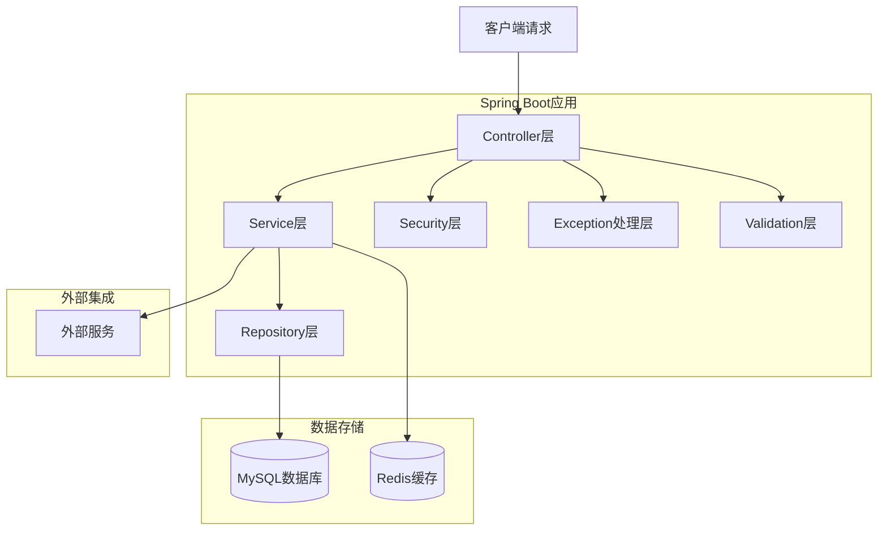

# 万里后端项目综合部署指导方案

## 目录
- [1. 项目概述](#1-项目概述)
- [2. 技术架构设计](#2-技术架构设计)
- [3. 免费云服务资源选择](#3-免费云服务资源选择)
- [4. 环境配置](#4-环境配置)
- [5. CI/CD流程配置](#5-cicd流程配置)
- [6. 数据模型和API定义](#6-数据模型和api定义)
- [7. 安全架构](#7-安全架构)
- [8. 性能优化](#8-性能优化)
- [9. 监控和维护](#9-监控和维护)
- [10. 部署步骤](#10-部署步骤)
- [11. 故障排除](#11-故障排除)
- [12. 成本优化建议](#12-成本优化建议)

## 1. 项目概述

### 1.1 技术栈
- **前端**: React 18 + TypeScript + Vite + TailwindCSS
- **后端框架**: Spring Boot 3.2.x + Java 17
- **数据库**: MySQL 8.0 (Railway托管) + Redis 7.x (缓存)
- **ORM**: Spring Data JPA + Hibernate 6.x
- **认证**: Spring Security 6.x + JWT
- **构建工具**: Maven 3.9.x
- **部署平台**: Railway (主要)
- **版本控制**: GitHub
- **CI/CD**: GitHub Actions
- **监控**: Sentry + UptimeRobot + Spring Boot Actuator
- **代码质量**: SonarCloud + Checkstyle + SpotBugs + PMD

### 1.2 分支管理策略和部署环境
- `main`: 生产环境分支 (部署到Railway)
- `staging`: 测试环境分支 (部署到Railway)
- `dev`: 开发环境分支 (本地运行)
- `feature/*`: 功能开发分支
- `hotfix/*`: 紧急修复分支

### 1.3 部署环境说明
- **开发环境 (dev)**: 本地运行，使用内嵌Tomcat服务器，连接本地MySQL和Redis
- **测试环境 (staging)**: 部署到Railway平台，使用Railway提供的MySQL和Redis服务
- **生产环境 (production)**: 部署到Railway平台，使用Railway提供的MySQL和Redis服务

## 2. 技术架构设计

### 2.1 整体架构图



### 2.2 服务器架构图



### 2.3 API路由定义

| 路由 | 用途 |
|------|------|
| /api/auth/login | 用户登录接口 |
| /api/auth/register | 用户注册接口 |
| /api/auth/refresh | JWT令牌刷新 |
| /api/users/profile | 用户个人资料管理 |
| /api/courses | 课程管理接口 |
| /api/courses/{id} | 单个课程操作 |
| /api/health | 应用健康检查 |
| /api/actuator/health | Spring Boot健康检查 |
| /api/actuator/info | 应用信息接口 |
| /api/actuator/metrics | 应用指标监控 |

## 3. 免费云服务资源选择

### 3.1 核心服务

#### Railway (主要部署平台)
- **免费额度**: $5/月免费额度
- **包含服务**: 
  - Web应用部署
  - PostgreSQL/MySQL数据库
  - Redis缓存
  - 自动SSL证书
  - 自定义域名支持

#### GitHub (代码托管和CI/CD)
- **免费额度**: 
  - 无限公共仓库
  - 私有仓库支持
  - GitHub Actions: 2000分钟/月
  - GitHub Packages: 500MB存储

### 3.2 辅助服务

#### 监控和日志
- **UptimeRobot**: 免费网站监控 (50个监控点)
- **Sentry**: 免费错误追踪 (5000错误/月)
- **SonarCloud**: 免费代码质量分析

#### 邮件服务
- **SendGrid**: 免费邮件发送 (100封/天)
- **Resend**: 免费邮件服务 (3000封/月)

#### 文件存储
- **Cloudinary**: 免费图片/视频处理 (25GB存储)
- **AWS S3**: 免费层 (5GB存储，12个月)

#### DNS和CDN
- **Cloudflare**: 免费CDN和DNS
- **Vercel**: 免费静态资源托管

## 4. 环境配置

### 4.1 本地开发环境 (dev分支)

#### 必需工具安装
```bash
# Java 17 (推荐使用SDKMAN)
curl -s "https://get.sdkman.io" | bash
source "$HOME/.sdkman/bin/sdkman-init.sh"
sdk install java 17.0.9-tem
sdk use java 17.0.9-tem

# Maven
sdk install maven 3.9.6

# Git (macOS)
brew install git

# MySQL 8.0
brew install mysql@8.0
brew services start mysql@8.0

# Redis 7.x
brew install redis
brew services start redis

# Railway CLI
npm install -g @railway/cli
```

#### 本地数据库初始化
```bash
# 连接MySQL并创建数据库
mysql -u root -p

# 在MySQL中执行
CREATE DATABASE wanli_dev CHARACTER SET utf8mb4 COLLATE utf8mb4_unicode_ci;
CREATE USER 'wanli_dev'@'localhost' IDENTIFIED BY 'dev_password_123';
GRANT ALL PRIVILEGES ON wanli_dev.* TO 'wanli_dev'@'localhost';
FLUSH PRIVILEGES;
EXIT;
```

#### 本地服务启动
```bash
# 启动Spring Boot应用 (使用内嵌Tomcat)
mvn spring-boot:run

# 或者使用IDE运行主类
# com.wanli.WanliBackendApplication
```

#### 环境变量配置
创建 `src/main/resources/application-dev.yml`：
```yaml
spring:
  profiles:
    active: dev
  datasource:
    url: jdbc:mysql://localhost:3306/wanli_dev?useSSL=false&serverTimezone=Asia/Shanghai&characterEncoding=utf8mb4
    username: wanli_dev
    password: dev_password_123
    driver-class-name: com.mysql.cj.jdbc.Driver
  jpa:
    hibernate:
      ddl-auto: update
    show-sql: true
    properties:
      hibernate:
        dialect: org.hibernate.dialect.MySQL8Dialect
        format_sql: true
  data:
    redis:
      host: localhost
      port: 6379
      timeout: 2000ms
      lettuce:
        pool:
          max-active: 8
          max-idle: 8
          min-idle: 0
  mail:
    host: smtphz.qiye.163.com
    port: 465
    username: wuning@wanli.ai
    password: CPyx-8vBkKhn5Fx
    properties:
      mail:
        smtp:
          ssl:
            enable: true
          auth: true

server:
  port: 8080
  servlet:
    context-path: /api

jwt:
  secret: ${JWT_SECRET:dev-jwt-secret-key-at-least-32-characters-long}
  expiration: 86400000

management:
  endpoints:
    web:
      exposure:
        include: health,info,metrics
  endpoint:
    health:
      show-details: always

logging:
  level:
    com.wanli: DEBUG
    org.springframework.security: DEBUG
```

### 4.2 Railway项目配置

#### 创建Railway项目
```bash
# 登录Railway
railway login

# 创建staging项目
railway init --name wanli-backend-staging
railway add --service mysql
railway add --service redis

# 创建production项目
railway init --name wanli-backend-production
railway add --service mysql
railway add --service redis
```

#### Railway环境变量配置

**测试环境 (staging)**
```env
# Spring配置
SPRING_PROFILES_ACTIVE=staging
SERVER_PORT=8080

# 数据库配置 (使用Railway变量)
SPRING_DATASOURCE_URL=jdbc:mysql://${MYSQL_HOST}:${MYSQL_PORT}/${MYSQL_DATABASE}?useSSL=true&serverTimezone=Asia/Shanghai&characterEncoding=utf8mb4
SPRING_DATASOURCE_USERNAME=${MYSQL_USER}
SPRING_DATASOURCE_PASSWORD=${MYSQL_PASSWORD}

# Redis配置 (使用Railway变量)
SPRING_DATA_REDIS_HOST=${REDIS_HOST}
SPRING_DATA_REDIS_PORT=${REDIS_PORT}
SPRING_DATA_REDIS_PASSWORD=${REDIS_PASSWORD}

# JWT配置
JWT_SECRET=staging-jwt-secret-key-must-be-at-least-32-characters-long-for-security
JWT_EXPIRATION=86400000

# CORS配置
CORS_ALLOWED_ORIGINS=https://staging-wanli.railway.app,http://localhost:3000

# 邮件配置
SPRING_MAIL_HOST=smtphz.qiye.163.com
SPRING_MAIL_PORT=465
SPRING_MAIL_USERNAME=wuning@wanli.ai
SPRING_MAIL_PASSWORD=CPyx-8vBkKhn5Fx

# 监控配置
MANAGEMENT_ENDPOINTS_WEB_EXPOSURE_INCLUDE=health,info,metrics
SENTRY_DSN=https://your-staging-sentry-dsn@sentry.io/project-id
```

**生产环境 (production)**
```env
# Spring配置
SPRING_PROFILES_ACTIVE=prod
SERVER_PORT=8080

# 数据库配置 (使用Railway变量)
SPRING_DATASOURCE_URL=jdbc:mysql://${MYSQL_HOST}:${MYSQL_PORT}/${MYSQL_DATABASE}?useSSL=true&serverTimezone=Asia/Shanghai&characterEncoding=utf8mb4
SPRING_DATASOURCE_USERNAME=${MYSQL_USER}
SPRING_DATASOURCE_PASSWORD=${MYSQL_PASSWORD}

# Redis配置 (使用Railway变量)
SPRING_DATA_REDIS_HOST=${REDIS_HOST}
SPRING_DATA_REDIS_PORT=${REDIS_PORT}
SPRING_DATA_REDIS_PASSWORD=${REDIS_PASSWORD}

# JWT配置
JWT_SECRET=production-jwt-secret-key-must-be-very-strong-and-at-least-32-characters
JWT_EXPIRATION=86400000

# CORS配置
CORS_ALLOWED_ORIGINS=https://wanli.com,https://www.wanli.com

# 邮件配置
SPRING_MAIL_HOST=smtphz.qiye.163.com
SPRING_MAIL_PORT=465
SPRING_MAIL_USERNAME=wuning@wanli.ai
SPRING_MAIL_PASSWORD=CPyx-8vBkKhn5Fx

# 监控配置
MANAGEMENT_ENDPOINTS_WEB_EXPOSURE_INCLUDE=health,info
SENTRY_DSN=https://your-production-sentry-dsn@sentry.io/project-id
```

## 5. CI/CD流程配置

### 5.1 GitHub Actions工作流

项目已配置完整的CI/CD流水线，包括：

- **测试阶段**: 单元测试、集成测试、代码覆盖率报告
- **代码质量**: SonarCloud分析、安全扫描
- **部署阶段**: 自动部署到不同环境
- **监控集成**: Sentry错误追踪、健康检查

详细配置请参考：`.github/workflows/ci-cd.yml`

### 5.2 GitHub Secrets配置

详细的Secrets配置指南请参考：`.github/SECRETS_SETUP.md`

## 6. 数据模型和API定义

### 6.1 核心实体模型

#### 用户实体 (User)
```java
@Entity
@Table(name = "users")
public class User {
    @Id
    @GeneratedValue(strategy = GenerationType.IDENTITY)
    private Long id;
    
    @Column(unique = true, nullable = false)
    private String username;
    
    @Column(unique = true, nullable = false)
    private String email;
    
    @Column(nullable = false)
    private String password;
    
    @Enumerated(EnumType.STRING)
    private UserRole role;
    
    @CreationTimestamp
    private LocalDateTime createdAt;
    
    @UpdateTimestamp
    private LocalDateTime updatedAt;
}
```

#### 课程实体 (Course)
```java
@Entity
@Table(name = "courses")
public class Course {
    @Id
    @GeneratedValue(strategy = GenerationType.IDENTITY)
    private Long id;
    
    @Column(nullable = false)
    private String title;
    
    @Column(columnDefinition = "TEXT")
    private String description;
    
    @ManyToOne(fetch = FetchType.LAZY)
    @JoinColumn(name = "instructor_id")
    private User instructor;
    
    @Enumerated(EnumType.STRING)
    private CourseStatus status;
    
    @CreationTimestamp
    private LocalDateTime createdAt;
    
    @UpdateTimestamp
    private LocalDateTime updatedAt;
}
```

### 6.2 API接口规范

#### 认证接口
```java
@RestController
@RequestMapping("/api/auth")
public class AuthController {
    
    @PostMapping("/login")
    public ResponseEntity<AuthResponse> login(@RequestBody LoginRequest request);
    
    @PostMapping("/register")
    public ResponseEntity<AuthResponse> register(@RequestBody RegisterRequest request);
    
    @PostMapping("/refresh")
    public ResponseEntity<AuthResponse> refresh(@RequestBody RefreshTokenRequest request);
}
```

#### 用户管理接口
```java
@RestController
@RequestMapping("/api/users")
public class UserController {
    
    @GetMapping("/profile")
    public ResponseEntity<UserProfile> getProfile();
    
    @PutMapping("/profile")
    public ResponseEntity<UserProfile> updateProfile(@RequestBody UpdateProfileRequest request);
    
    @PostMapping("/change-password")
    public ResponseEntity<Void> changePassword(@RequestBody ChangePasswordRequest request);
}
```

## 7. 安全架构

### 7.1 认证和授权

- **JWT Token**: 用于API认证
- **Spring Security**: 提供安全框架
- **CORS配置**: 跨域资源共享控制
- **HTTPS**: 强制使用SSL/TLS加密

### 7.2 数据安全

- **密码加密**: 使用BCrypt哈希算法
- **SQL注入防护**: 使用JPA参数化查询
- **XSS防护**: 输入验证和输出编码
- **CSRF防护**: Spring Security CSRF保护

### 7.3 API安全

- **请求限流**: 防止API滥用
- **输入验证**: 使用Bean Validation
- **错误处理**: 统一异常处理，避免信息泄露
- **日志审计**: 记录关键操作日志

## 8. 性能优化

### 8.1 数据库优化

- **连接池配置**: HikariCP连接池优化
- **查询优化**: 使用索引和查询优化
- **缓存策略**: Redis缓存热点数据
- **分页查询**: 避免大量数据查询

### 8.2 应用优化

- **JVM调优**: 内存和垃圾回收优化
- **异步处理**: 使用@Async处理耗时操作
- **压缩传输**: Gzip压缩响应数据
- **静态资源**: CDN加速静态资源

### 8.3 监控和调优

- **APM监控**: Sentry性能监控
- **指标收集**: Spring Boot Actuator
- **日志分析**: 结构化日志记录
- **健康检查**: 自定义健康检查端点

## 9. 监控和维护

### 9.1 应用监控

- **Sentry**: 错误追踪和性能监控
- **UptimeRobot**: 网站可用性监控
- **Spring Boot Actuator**: 应用健康状态
- **Railway Metrics**: 基础设施监控

### 9.2 日志管理

- **结构化日志**: JSON格式日志输出
- **日志级别**: 不同环境使用不同日志级别
- **日志轮转**: 防止日志文件过大
- **敏感信息**: 避免记录敏感数据

### 9.3 备份策略

- **数据库备份**: Railway自动备份
- **代码备份**: GitHub版本控制
- **配置备份**: 环境变量文档化
- **恢复测试**: 定期测试恢复流程

## 10. 部署步骤

### 10.1 首次部署

1. **准备工作**
   ```bash
   # 克隆项目
   git clone https://github.com/JamesWuVip/wanli-backend.git
   cd wanli-backend
   
   # 切换到dev分支
   git checkout dev
   ```

2. **本地环境设置**
   ```bash
   # 安装依赖
   mvn clean install
   
   # 启动本地服务
   mvn spring-boot:run
   ```

3. **Railway部署**
   ```bash
   # 登录Railway
   railway login
   
   # 部署到staging
   git checkout staging
   git merge dev
   git push origin staging
   
   # 部署到production
   git checkout main
   git merge staging
   git push origin main
   ```

### 10.2 日常部署流程

1. **功能开发**
   ```bash
   # 创建功能分支
   git checkout -b feature/new-feature
   
   # 开发完成后合并到dev
   git checkout dev
   git merge feature/new-feature
   git push origin dev
   ```

2. **测试环境部署**
   ```bash
   # 合并到staging分支
   git checkout staging
   git merge dev
   git push origin staging
   ```

3. **生产环境部署**
   ```bash
   # 测试通过后合并到main
   git checkout main
   git merge staging
   git push origin main
   ```

## 11. 故障排除

### 11.1 常见问题

#### 数据库连接问题
```bash
# 检查数据库连接
curl -X GET https://your-app.railway.app/api/actuator/health

# 检查环境变量
railway variables
```

#### 应用启动失败
```bash
# 查看应用日志
railway logs

# 检查构建日志
railway logs --deployment
```

#### 内存不足
```bash
# 调整JVM参数
export JAVA_OPTS="-Xmx512m -Xms256m"
```

### 11.2 性能问题

#### 响应时间慢
1. 检查数据库查询性能
2. 查看Redis缓存命中率
3. 分析Sentry性能数据
4. 优化SQL查询和索引

#### 内存泄漏
1. 使用JVM监控工具
2. 分析堆转储文件
3. 检查缓存配置
4. 优化对象生命周期

### 11.3 安全问题

#### JWT Token问题
```java
// 检查Token有效性
@GetMapping("/validate-token")
public ResponseEntity<Boolean> validateToken(@RequestHeader("Authorization") String token) {
    return ResponseEntity.ok(jwtService.validateToken(token));
}
```

#### CORS问题
```yaml
# 配置CORS
cors:
  allowed-origins: https://your-frontend-domain.com
  allowed-methods: GET,POST,PUT,DELETE,OPTIONS
  allowed-headers: "*"
```

## 12. 成本优化建议

### 12.1 Railway优化

- **资源监控**: 定期检查资源使用情况
- **自动缩放**: 配置合适的实例数量
- **数据库优化**: 优化查询减少数据库负载
- **缓存策略**: 使用Redis减少数据库访问

### 12.2 第三方服务优化

- **Sentry**: 合理设置错误采样率
- **SendGrid**: 优化邮件发送频率
- **SonarCloud**: 定期清理旧分析数据
- **UptimeRobot**: 合理设置监控频率

### 12.3 开发效率优化

- **自动化测试**: 减少手动测试时间
- **CI/CD优化**: 优化构建和部署流程
- **代码质量**: 提前发现和修复问题
- **文档维护**: 保持文档更新和准确

---

## 附录

### A. 环境变量清单

详细的环境变量配置请参考：`ENVIRONMENT_VARIABLES_SETUP_GUIDE.md`

### B. GitHub Secrets配置

详细的Secrets配置请参考：`.github/SECRETS_SETUP.md`

### C. 监控配置

详细的监控配置请参考：`setup-monitoring.sh`

### D. 代码质量配置

详细的代码质量配置请参考：`sonar-project.properties`

---

**文档版本**: v2.0  
**最后更新**: 2024年1月  
**维护者**: 万里后端开发团队